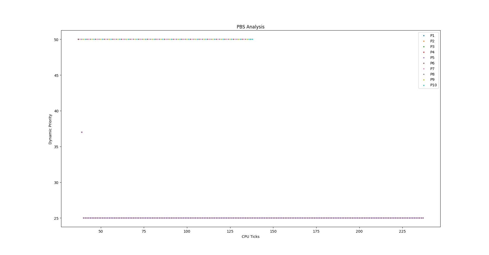
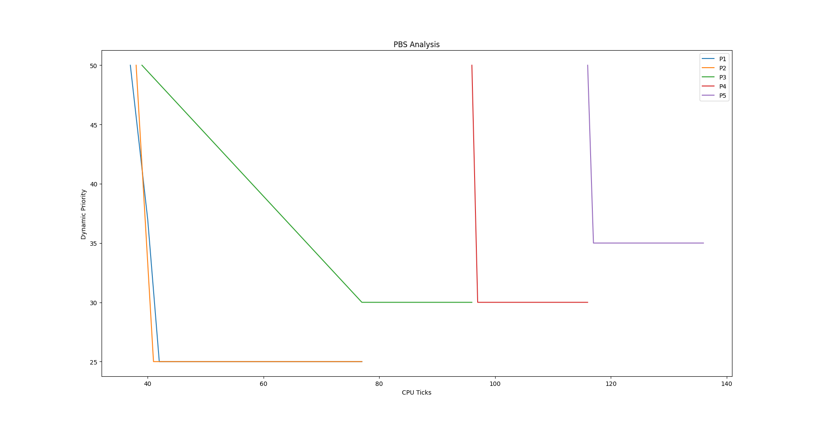

# xv6 project(s)

Some xv6 projects as part of my Operating Systems and Networking Class.

# Testing system calls

## Getting runtimes and waittimes for your schedulers
- Run the following command in xv6:
    ```sh
    prompt> schedulertest
    ```  
---

## Running tests for entire xv6 OS
- Run the following command in xv6:
    ```sh
    prompt> usertests
    ```

# System Calls

## `getreadcount`

## Running Tests for getreadcount

Running tests for this syscall is easy. Just do the following from
inside the `initial-xv6` directory:

```sh
prompt> ./test-getreadcounts.sh
```

If you implemented things correctly, you should get some notification
that the tests passed. If not ...

The tests assume that xv6 source code is found in the `src/` subdirectory.
If it's not there, the script will complain.

The test script does a one-time clean build of your xv6 source code
using a newly generated makefile called `Makefile.test`. You can use
this when debugging (assuming you ever make mistakes, that is), e.g.:

```sh
prompt> cd src/
prompt> make -f Makefile.test qemu-nox
```

You can suppress the repeated building of xv6 in the tests with the
`-s` flag. This should make repeated testing faster:

```sh
prompt> ./test-getreadcounts.sh -s
```

## `sigalarm` and `sigreturn`

1. For `sigalarm`, the `handler` function will have no arguments defined (taking a hint from the `alaramtest.c` file). I have allowed the return type to be anything (by using `void`) but it will not be used anyway.
2. For `sigalarm`, to disable any alarm handling, pass any negative value to the `handler` or `interval` argument of `sigalarm()`

## Running Tests for sigalarm and sigreturn

**After implementing both sigalarm and sigreturn**, do the following:
- Make the entry for `alarmtest` in `src/Makefile` inside `UPROGS`
- Run the command inside xv6:
    ```sh
    prompt> alarmtest
    ```

# Schedulers

## First Come First Serve (FCFS)

For FCFS scheduling, note that on running `usertests`, the test `preempt` will not work (if 1 <`CPUS` <= 3) as FCFS requires preemption to be disabled. Moreover, in this test the difference in creation times of the parent and its three children is not enough to count as a whole CPU tick, so once the parent process (the process for the `preempt` test) goes to sleep during the `read` syscall, it will never be woken up again, and its three children will be scheduled to run on the CPUS (as many as can be obviously). Since the parent never becomes runnable again, it is never scheduled even, so it can never kill the children and the test won't pass as the children essentially loop forever. Similarly, for 1 CPU, it will fail `usertests` on the test `killstatus`.

### Implementation

My implementation of FCFS scheduling involves the `scheduler()` function in `kernel/proc.c` file. In the infinite loop, I first find the oldest runnable process, by iterating through the global `proc` array, to find the process with the least creation time (`p->ctime`), such that its state (`p->state`) is RUNNABLE.

Then, I simply schedule this oldest runnable process to run for one tick. I could have made it run till completion, but since preemption is disabled, this implementation is equivalent to it, as since a process has been selected as the oldest runnable process, it will continue to be so until it exits.

I have disabled preemption, as FCFS requires a process be run till completion, by simply using the `ifndef` preprocessor directives with the `FCFS` macro (as introduced in the makefile) around the call to `yield()` in the `usertrap()` and `kerneltrap()` functions in `kernel/trap.c`.

## Multi Level Feedback Queues (MLFQ)

For MLFQ, I also demote a process if it went for I/O, just before using up its whole slice, and so the kernel only got back control after the whole time slice was used up.

### Implementation

I have used a lazy implementation of the MLFQ cheduling algorithm, wherein I have not explicitly created four process queues, but have stored each process' priority queue number in its PCB (`struct proc`), `p->priorityQueue`. I have also added two fields in the structure, `p->curRunSliceTicks` and `p->waitingTicks`, respectively representing the ticks elapsed sice the process started running in its current slice (it is zero if the process is not running), and the ticks elapsed since the process last became runnable, i.e. the number of CPU ticks the process has waited to be scheduled. These come in handy in the handling of demotion and promotion/aging of processes.

The basic idea behind MLFQ is to run the processes in the highest priority queue in round robin fashion, each for the appropriate number of ticks and then move down to lower queues. If a process uses up its whole time slice, it is demoted to the next lower queue, and not if it relinquishes control within its time slice. If a process has to wait for longer than a threshold time (I have taken it to be 30 ticks), it gets promoted to the next higher queue. If while a process is running, another process with a greater priority arrives, it is preempted and the new process is scheduled. That is, MLFQ is preemptive.

Note that this does not explicitly say whether a process which went for say I/O should be demoted if it did so at exactly the last tick, which means the kernel regains control after the whole time slice has elapsed. (refer assumption 6)

To implement this, I have used the default two `for` loops in the RR scheduler (because we need RR within each queue), and then I select a process to run, if it is runnable and its priority queue is the highest non-empty one (I created a separate function,`highestNonEmptyPQ()` in `kernel/proc.c` for this). Once selected, I let it run. In this `while` loop, I run the process (if it is runnable) for one tick. Then I check if it some other higher priority process has arrived or not, and if the current one has not exhausted its time slice. If so, I reset its tick counters and preempt it out. Otherwise, if it has exhausted its time slice, I reset its tick counters, and demote it to the next lower queue if it can be demoted (if its queue is less than 3) and then I preempt it out. If even this condition does not hold, I check if the process is no longer runnable. If so, I reset its tick counters and break out of the `while` loop, moving on to schedule the next eligible process.

To implement aging, I update the waiting time of each process that is not running but it runnable (waiting for execution). For this, I iterate through the `proc` array in `usertrap()` in `kernel/trap.c` and check for runnable processes that are not the current process, and update their waiting times. If the waiting times of the process equals (or exceeds just in case) the threshold (30 ticks for me), I simply promote it to the next higher priority queue, and reset its waiting tick counter.

## Performance Comparison

The following shows the average runtimes and average waiting times of the 10 child processes (5 I/O bound and 5 CPU bound) spawned by the `schedulertest` process, all on one CPU

### Round Robin Scheduler

Average runtime: 9 ticks

Average waiting time: 138 ticks

### FCFS Scheduler

Average runtime: 9 ticks

Average waiting time: 119 ticks

### MLFQ Scheduler

Average runtime: 9 ticks

Average waiting time: 125 ticks

## Timeline graph for MLFQ

I have created a user program (`user/mlfqtest.c`) to create 5 child processes, and modified the kernel code to print some data on the terminal.
I have written another program, in python, (`mlfqtest.py`, click [here](/mlfqtest.py)), which if run by following the instructions in the C file, produces the following graph.


## Modified Priority-Based Scheduler (PBS)

1. If the scheduler is not set to `PBS` and the system call `set_priority` is used, or if `set_priority` is passed an invalid `pid` or `new_priority`, it will simply return -1.
2. `In case two or more processes have the same priority, we use the number of times the process has been scheduled to break the tie.` I assume here that a process that has been scheduled for a lesser number of times will be chosen.

### Implementation

I have implemented PBS in xv6 by following similar procedure to the scheduers specified in the previous assignment.

I have used a compile time macro to enable PBS, to be passed as `SCHEDULER=PBS` along with `make qemu`.

I have modified the process structure `struct proc` to have the following fields for the quantities defined in the specification:
- `RTime`: The time (in ticks) the process spent in the current "iteration" of execution. Since the scheduler is preemptive, it can only take the value 0 or 1.
- `WTime`: The time (in ticks) the process spent waiting in the ready queue since it was created.
- `STime`: The time (in ticks) the process spent in the `SLEEPING` state, since the last time it was scheduled.
- `RBI`: The "Recent Behaviour Index", a function of the above parameters
- `StaticPriority`: A base priority for the process, can be changed by calling `set_priority`.
- `DynamicPriority`: The metric used to schedule processes, a function of `StaticPriority` and `RBI`.

To schedule a process, we work in `kernel/proc.c:scheduler()`.
I first update the `RBI` and `DynamicPriority` of each process, and then find the process with the highest `DynamicPriority` (least value). To break ties, I select the process which has been scheduled fewer number of times (my assumption), and to further break a tie (if any), I select the earliest created process. While unimportant, it is worth noting that ties can still remain (as creation time is stored in `proc::ctime`, with the unit being CPU ticks; one tick is in the order of milliseconds.). So the process chosen is dependent on how we iterate the process list, which in my case is in increasing order of index (in the list), so the first such process is chosen to be scheduled.

If the chosen process is in the `RUNNABLE` state, I reset its time counters, do a context switch (calling `swtch()`), and then update the time counters once it comes back, also updating the values of its `RBI` and `DynamicPriority`.

For sleeping and waiting processes, the values of the respecxtive parameters `STime` and `WTime` are updated in `kernel/usertrap.c:usertrap()`

### Analysis

We have the following definitions.

$RBI = max(int(\frac{3 * RTime - STime - WTime}{RTime + STime + WTime + 1} * 50), 0)$

$DP = min(SP + RBI, 100)$

Consider the following facts:
1. $RTime$ is only either 0 or 1,
2. $WTime$ keeps on increasing throughout the course of the process' existence, while the other two time parameters are reset to zero every time the process gets scheduled.

Therefore, over a reasonably long period of time (say ~100 ticks), $WTime$ becomes large enough for us to ignore $3 * RTime$ in the numerator and $RTime + 1$ in the denominator. Thus the first equation becomes:

$RBI = max(int(\frac{- (STime + WTime)}{STime + WTime} * 50), 0) = max(int(\frac{- STime - WTime}{STime + WTime} * 50), 0) = max(-50, 0) = 0$

Thus, eventually, $RBI$ will become zero.

And since $SP \in [0, 100]$, this makes the second equation

$DP = min(SP, 100) = SP$ 

So, each process will be scheduled based on their static priorities, with processes with higher static priorities (lower value of $SP$) getting scheduled first. And, among processes with the same value of $SP$, the tie would be broken by using the number of times they've been scheduled and their creation times. If we keep these two the same, we essentially get a round-robin based scheduling among the processes, since we iterate through the process array to find the highest-priority process, and schedule it for one tick.

This is evidenced by the following plots, which are from the data given by running `pbstest` (`user/pbstest.c`) in the xv6 shell and plotted using `/pbstest.py`.

#### Plot 1

Run `pbstest 0` on the xv6 shell.

This is the plot of the dynamic priorities of processes against CPU ticks for 10 processes, the first five of which are I/O bound processes and the latter five are CPU bound processes. Upon being created, the I/O bound processes set their static priorities to 25 by calling `set_priority`.



We can see here that the last 5 (CPU bound) processes are all running with $DP$ unchangingly at 50, which follows from the conclusion we reached that $SP = DP$ and the fact that default value of $SP$ is 50. We can clearly see the round-robin naure of the scheduling by looking at interleaving dots, which shows that these processes run at different ticks, alternating among one another sequentially.

As for the I/O procceses, their static priority has been set to 25 upon their creation, so we see them running with $DP = 25$ too. The initial dot midway between $DP = 50$ and $DP = 25$ is because the processes start with the default $SP = 50$, and the change to $SP = 25$ takes some time. The below line plot makes this clearer. Since they are I/O processes, they don't use CPU time that much, so their plots appear overlapped


### Plot 2

Run `pbstest 1` on the xv6 shell.

This is the plot of the dynamic priorities against CPU ticks for 5 CPU bound processes, with two of them set to $SP = 25$, two others set to $SP = 30$ and the one remaining set to $SP = 35$.



We can see here that the processes start with $DP = 50$, as with the last plot, since there is some time interval between the processes starting with the default $SP = 50$ (hence $DP = 50$), and them calling `set_priority` to change their $SP$ values.

`P1` and `P2`, with the least $DP$ values, start first, executing in round-robin fashion (see scatter plot below for more clarity), then the next two processes, `P3` and `P4` executing next, with `P3` executing completely first since `P4` (as well as `P5`) has $DP = 50$. This is because `P1`, `P2` and `P3` started first, boosted their static priorities, thus ensuring that they continue executing till completion as descibed till now. `P4` and `P5`, however, don't even get started, so stay at the default value of $SP = 50$. Thus we see `P3` finishing before `P4`, and `P5` executing last with $DP = 35$.


So we can conclude that the given specification of PBS has different priorities for processes, with processes having the same priorities executing in round-robin fashion.

# Copy-on-Write (CoW) Fork

For CoW fork, I mark the pages of the parent as read-only when it forks a child, even if some of those pages had write permission.

- in kalloc, set the reference count of the page to one.
- in uvmcopy, simply copy over parent's page table to the child, with PTE_W cleared for both. do not copy memory. increase reference count of page by 1.
- in kfree, decrease reference count of page by 1, and free only if reference count of page is 0.
- handle page faults in usertrap, by copying the page for the faulting process, updating its pte and adding the pte_w flag, decrease the ref count for the original page.
- use sfence_vma() to flush the TLB whenever any page table is changed

## References:
1. Page fault codes: https://pdos.csail.mit.edu/6.828/2019/lec/l-usingvm.pdf
2. Resources:
    - https://pdos.csail.mit.edu/6.828/2023/labs/cow.html
    - https://www.cse.iitb.ac.in/~mythili/teaching/cs347_autumn2016/labs/lab6.pdf

# General Note

- Because we're using macros to change the scheduler, I am using the `touch` command to provide for the `make` command to change the files using those macros, so as to to not have to do a `make clean` before changing the scheduler (or the number of CPUS for that matter).
- I have modified `proc.c:procdump()` to print the creation time of the process as well, and the priority queue of the process if MLFQ is used as the scheduler.
