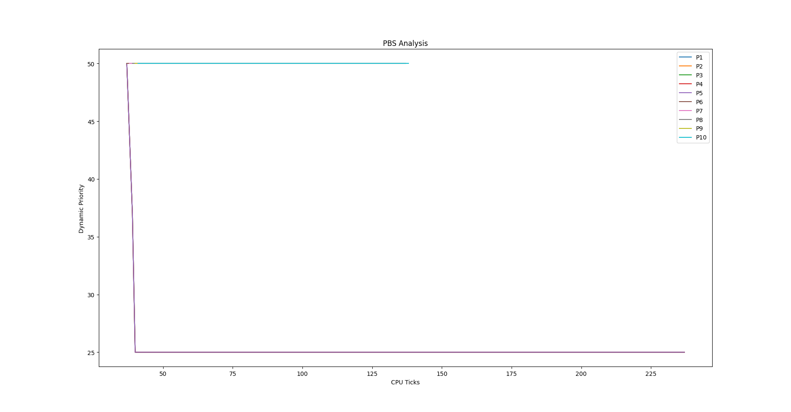
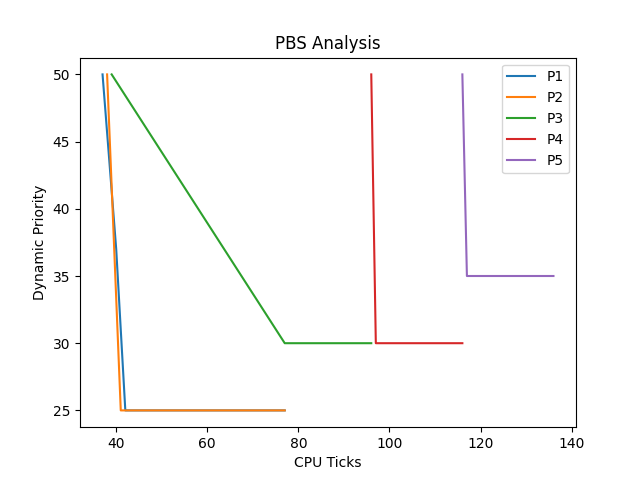
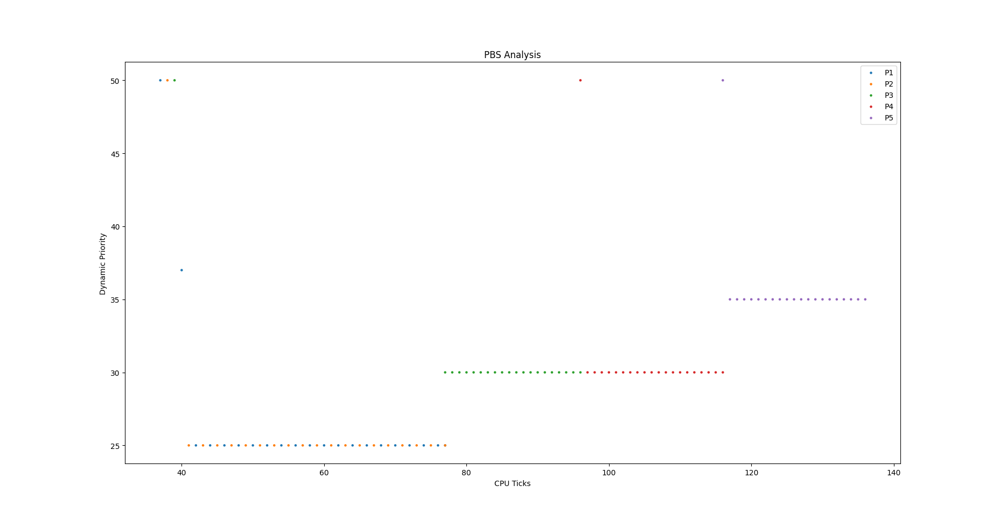

# Report for the Project

## Specification 1: Modified Priority Based Scheduler in xv-6

### Implementation

I have implemented PBS in xv6 by following similar procedure to the scheduers specified in the previous assignment.

I have used a compile time macro to enable PBS, to be passed as `SCHEDULER=PBS` along with `make qemu`.

I have modified the process structure `struct proc` to have the following fields for the quantities defined in the specification:
- `RTime`: The time (in ticks) the process spent in the current "iteration" of execution. Since the scheduler is preemptive, it can only take the value 0 or 1.
- `WTime`: The time (in ticks) the process spent waiting in the ready queue since it was created.
- `STime`: The time (in ticks) the process spent in the `SLEEPING` state, since the last time it was scheduled.
- `RBI`: The "Recent Behaviour Index", a function of the above parameters
- `StaticPriority`: A base priority for the process, can be changed by calling `set_priority`.
- `DynamicPriority`: The metric used to schedule processes, a function of `StaticPriority` and `RBI`.

To schedule a process, we work in `kernel/proc.c:scheduler()`.
I first update the `RBI` and `DynamicPriority` of each process, and then find the process with the highest `DynamicPriority` (least value). To break ties, I select the process which has been scheduled fewer number of times (my assumption), and to further break a tie (if any), I select the earliest created process. While unimportant, it is worth noting that ties can still remain (as creation time is stored in `proc::ctime`, with the unit being CPU ticks; one tick is in the order of milliseconds.). So the process chosen is dependent on how we iterate the process list, which in my case is in increasing order of index (in the list), so the first such process is chosen to be scheduled.

If the chosen process is in the `RUNNABLE` state, I reset its time counters, do a context switch (calling `swtch()`), and then update the time counters once it comes back, also updating the values of its `RBI` and `DynamicPriority`.

For sleeping and waiting processes, the values of the respecxtive parameters `STime` and `WTime` are updated in `kernel/usertrap.c:usertrap()`

### Analysis

We have the following definitions.

$RBI = max(int(\frac{3 * RTime - STime - WTime}{RTime + STime + WTime + 1} * 50), 0)$

$DP = min(SP + RBI, 100)$

Consider the following facts:
1. $RTime$ is only either 0 or 1,
2. $WTime$ keeps on increasing throughout the course of the process' existence, while the other two time parameters are reset to zero every time the process gets scheduled.

Therefore, over a reasonably long period of time (say ~100 ticks), $WTime$ becomes large enough for us to ignore $3 * RTime$ in the numerator and $RTime + 1$ in the denominator. Thus the first equation becomes:

$RBI = max(int(\frac{- (STime + WTime)}{STime + WTime} * 50), 0) = max(int(\frac{- STime - WTime}{STime + WTime} * 50), 0) = max(-50, 0) = 0$

Thus, eventually, $RBI$ will become zero.

And since $SP \in [0, 100]$, this makes the second equation

$DP = min(SP, 100) = SP$ 

So, each process will be scheduled based on their static priorities, with processes with higher static priorities (lower value of $SP$) getting scheduled first. And, among processes with the same value of $SP$, the tie would be broken by using the number of times they've been scheduled and their creation times. If we keep these two the same, we essentially get a round-robin based scheduling among the processes, since we iterate through the process array to find the highest-priority process, and schedule it for one tick.

This is evidenced by the following plots, which are from the data given by running `pbstest` (`user/pbstest.c`) in the xv6 shell and plotted using `/pbstest.py`.

#### Plot 1

Run `pbstest 0` on the xv6 shell.

This is the plot of the dynamic priorities of processes against CPU ticks for 10 processes, the first five of which are I/O bound processes and the latter five are CPU bound processes. Upon being created, the I/O bound processes set their static priorities to 25 by calling `set_priority`.

We can see here that the last 5 (CPU bound) processes are all running with $DP$ unchangingly at 50, which follows from the conclusion we reached that $SP = DP$ and the fact that default value of $SP$ is 50. We can clearly see the round-robin naure of the scheduling by looking at interleaving dots, which shows that these processes run at different ticks, alternating among one another sequentially.

As for the I/O procceses, their static priority has been set to 25 upon their creation, so we see them running with $DP = 25$ too. The initial dot midway between $DP = 50$ and $DP = 25$ is because the processes start with the default $SP = 50$, and the change to $SP = 25$ takes some time. The below line plot makes this clearer. Since they are I/O processes, they don't use CPU time that much, so their plots appear overlapped

### Plot 2

Run `pbstest 1` on the xv6 shell.

This is the plot of the dynamic priorities against CPU ticks for 5 CPU bound processes, with two of them set to $SP = 25$, two others set to $SP = 30$ and the one remaining set to $SP = 35$.

We can see here that the processes start with $DP = 50$, as with the last plot, since there is some time interval between the processes starting with the default $SP = 50$ (hence $DP = 50$), and them calling `set_priority` to change their $SP$ values.

`P1` and `P2`, with the least $DP$ values, start first, executing in round-robin fashion (see scatter plot below for more clarity), then the next two processes, `P3` and `P4` executing next, with `P3` executing completely first since `P4` (as well as `P5`) has $DP = 50$. This is because `P1`, `P2` and `P3` started first, boosted their static priorities, thus ensuring that they continue executing till completion as descibed till now. `P4` and `P5`, however, don't even get started, so stay at the default value of $SP = 50$. Thus we see `P3` finishing before `P4`, and `P5` executing last with $DP = 35$.

So we can conclude that the given specification of PBS has different priorities for processes, with processes having the same priorities executing in round-robin fashion.

## Specification 3: Cafe Sim

## Specification 3: Ice Cream Parlour Sim