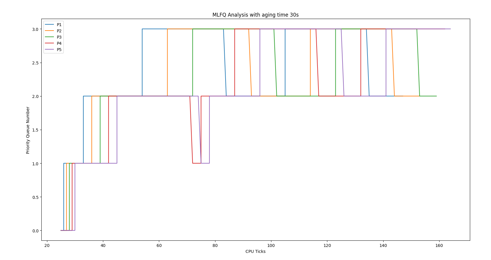

# Testing system calls

## Running Tests for getreadcount

Running tests for this syscall is easy. Just do the following from
inside the `initial-xv6` directory:

```sh
prompt> ./test-getreadcounts.sh
```

If you implemented things correctly, you should get some notification
that the tests passed. If not ...

The tests assume that xv6 source code is found in the `src/` subdirectory.
If it's not there, the script will complain.

The test script does a one-time clean build of your xv6 source code
using a newly generated makefile called `Makefile.test`. You can use
this when debugging (assuming you ever make mistakes, that is), e.g.:

```sh
prompt> cd src/
prompt> make -f Makefile.test qemu-nox
```

You can suppress the repeated building of xv6 in the tests with the
`-s` flag. This should make repeated testing faster:

```sh
prompt> ./test-getreadcounts.sh -s
```

---

## Running Tests for sigalarm and sigreturn

**After implementing both sigalarm and sigreturn**, do the following:
- Make the entry for `alarmtest` in `src/Makefile` inside `UPROGS`
- Run the command inside xv6:
    ```sh
    prompt> alarmtest
    ```

---

## Getting runtimes and waittimes for your schedulers
- Run the following command in xv6:
    ```sh
    prompt> schedulertest
    ```  
---

## Running tests for entire xv6 OS
- Run the following command in xv6:
    ```sh
    prompt> usertests
    ```

---

---

# Scheduling Report (Specification 3)

## Implementation of FCFS

My implementation of FCFS scheduling involves the `scheduler()` function in `kernel/proc.c` file. In the infinite loop, I first find the oldest runnable process, by iterating through the global `proc` array, to find the process with the least creation time (`p->ctime`), such that its state (`p->state`) is RUNNABLE.

Then, I simply schedule this oldest runnable process to run for one tick. I could have made it run till completion, but since preemption is disabled, this implementation is equivalent to it, as since a process has been selected as the oldest runnable process, it will continue to be so until it exits.

I have disabled preemption, as FCFS requires a process be run till completion, by simply using the `ifndef` preprocessor directives with the `FCFS` macro (as introduced in the makefile) around the call to `yield()` in the `usertrap()` and `kerneltrap()` functions in `kernel/trap.c`.

## Implementation of MLFQ

I have used a lazy implementation of the MLFQ cheduling algorithm, wherein I have not explicitly created four process queues, but have stored each process' priority queue number in its PCB (`struct proc`), `p->priorityQueue`. I have also added two fields in the structure, `p->curRunSliceTicks` and `p->waitingTicks`, respectively representing the ticks elapsed sice the process started running in its current slice (it is zero if the process is not running), and the ticks elapsed since the process last became runnable, i.e. the number of CPU ticks the process has waited to be scheduled. These come in handy in the handling of demotion and promotion/aging of processes.

The basic idea behind MLFQ is to run the processes in the highest priority queue in round robin fashion, each for the appropriate number of ticks and then move down to lower queues. If a process uses up its whole time slice, it is demoted to the next lower queue, and not if it relinquishes control within its time slice. If a process has to wait for longer than a threshold time (I have taken it to be 30 ticks), it gets promoted to the next higher queue. If while a process is running, another process with a greater priority arrives, it is preempted and the new process is scheduled. That is, MLFQ is preemptive.

Note that this does not explicitly say whether a process which went for say I/O should be demoted if it did so at exactly the last tick, which means the kernel regains control after the whole time slice has elapsed. (refer assumption 6)

To implement this, I have used the default two `for` loops in the RR scheduler (because we need RR within each queue), and then I select a process to run, if it is runnable and its priority queue is the highest non-empty one (I created a separate function,`highestNonEmptyPQ()` in `kernel/proc.c` for this). Once selected, I let it run. In this `while` loop, I run the process (if it is runnable) for one tick. Then I check if it some other higher priority process has arrived or not, and if the current one has not exhausted its time slice. If so, I reset its tick counters and preempt it out. Otherwise, if it has exhausted its time slice, I reset its tick counters, and demote it to the next lower queue if it can be demoted (if its queue is less than 3) and then I preempt it out. If even this condition does not hold, I check if the process is no longer runnable. If so, I reset its tick counters and break out of the `while` loop, moving on to schedule the next eligible process.

To implement aging, I update the waiting time of each process that is not running but it runnable (waiting for execution). For this, I iterate through the `proc` array in `usertrap()` in `kernel/trap.c` and check for runnable processes that are not the current process, and update their waiting times. If the waiting times of the process equals (or exceeds just in case) the threshold (30 ticks for me), I simply promote it to the next higher priority queue, and reset its waiting tick counter.

## Performance Comparison

The following shows the average runtimes and average waiting times of the 10 child processes (5 I/O bound and 5 CPU bound) spawned by the `schedulertest` process, all on one CPU

### Round Robin Scheduler

Average runtime: 9 ticks

Average waiting time: 138 ticks

### FCFS Scheduler

Average runtime: 9 ticks

Average waiting time: 119 ticks

### MLFQ Scheduler

Average runtime: 9 ticks

Average waiting time: 125 ticks

## Timeline graph for MLFQ

I have created a user program (`user/mlfqtest.c`) to create 5 child processes, and modified the kernel code to print some data on the terminal.
I have written another program, in python, (`mlfqtest.py`, click [here](/mlfqtest.py)), which if run by following the instructions in the C file, produces the following graph.

